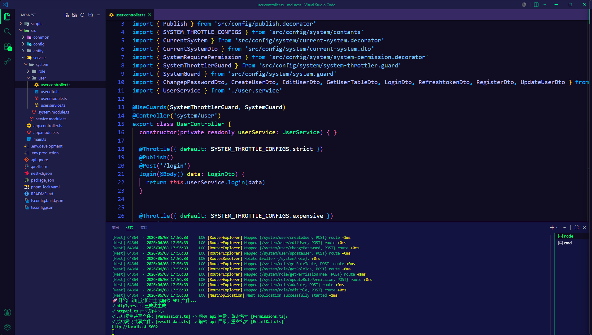

# 只做能掌控的事

## 灵感来源12

过年那会没什么事做，无聊就玩王者荣耀。

抖音刷视频刷到了高玩射手的全场视频，发现他从来都是保证自己的死亡次数。

从来都不会跟别人一换一，我就突然思考到："是啊，好像在游戏内能控制的只有自己，而自己能控制的只能是死亡次数。"

你不能保证是否能百分百击败对手，但是你能保证自己不和对面打，也就是百分百不阵亡。

<a href="https://qoder.com/referral?referral_code=giB4Qp8oAraMl3HnoBEqCoIavUwbZJPO">https://qoder.com/referral?referral_code=giB4Qp8oAraMl3HnoBEqCoIavUwbZJPO</a>

| 列1  | 列2  | 列3  |
| ---- | ---- | ---- |
| 内容 | 内容 | 内容 |
| 内容 | 内容 | 内容 |

## 带入交易

我开始思考交易我能控制什么呢？

盈利？谁能保证这单一定盈利？

亏损？是啊，我能在市场糟糕的时候主动离场。

开仓？我也能在市场不明确的时候不开单。

亏损时的主动离场不就是平仓吗？而一笔交易简而言之不就是开仓平仓吗？也就是一笔交易我能全部控制，但是就是不能保证是否盈利。

### 我的我前端期望

12312adsadasdas

## 步入正题

> 一笔交易简而言之不就是开仓平仓吗？也就是一笔交易我能全部控制，但是就是不能保证是否盈利。

这句话是不是觉得很矛盾？但是就是这么矛盾的话才是交易持续盈利的利剑

在我的交易系统中一笔交易分以下步骤：

1. 分析市场背景
2. 寻找系统内交易
3. 设定开仓位置和止盈止损位置
4. 订单管理

就是这么简单，然后我们细细分析。

**分析市场背景**：决定是否开仓(可控制)

**寻找系统内交易**: 过滤是否开仓(可控制)

**设定开仓位置**：分左侧和右侧，左侧盈亏比高，右侧胜率高(可控制)

**止损位置**：分左侧和右侧，左侧明确跌破关注位置离场，右侧跌破固定波段点离场，入场就设好了(可控制)

**止盈位置**：在`寻找系统内交易`的时候就设定好了，长线和短线止盈不同(不可控制)

**订单管理**：止损订单管理：在`止损位置`这一步就设定好了。止盈订单管理：移动止盈(可控制)

`寻找系统内交易`、`止盈位置`一定都是回测过往数据有大概的盈利期望值得出来的。

所以说交易为什么这么艰难？我们需要控制这么多才能在残酷的交易市场获得微弱的交易优势。

但交易又很简单，只需要坚持自己的交易系统就能永远盈利下去。

交易就是如此矛盾、模棱两可的，就像两段式回调会演变为三推，三推会演变为通道一样多变，而正是这一点才让无数人所着迷和热爱。
